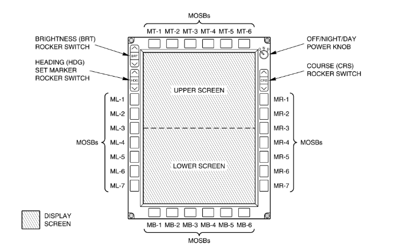
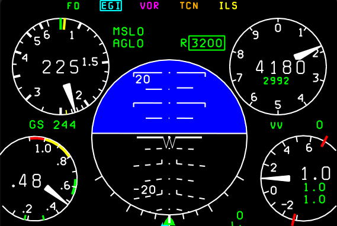

# Multi Function Display (MFD)
## Overview
Each Cockpit has an MFD in front of the pilot. The MFD displays information such as:

* Basic flight instruments
* Navigation data
* Weapons data

> T-38C Multi-Function Display button layout and naming scheme

!!! Note
    The above image shows the naming scheme for the MFD buttons (MOSBs). Further sections of the manual will reference the buttons as such.

Pressing MB1 will return you to the main menu (MENU1) at any time. Pressing any MOSB next to the displayed text will perform the labelled action, either switching pages, selecting data, or scrolling a list.

## Primary Gauges
The T-38C displays airspeed, altitude and attitude on all MFD displays. In addition, on the PFR, HSD and TSD pages (TODO add links) Angle of Attack and Vertical Acceleration (G Meter) are shown

*The 5 primary digital gauges*

