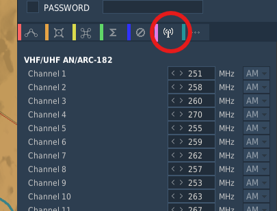
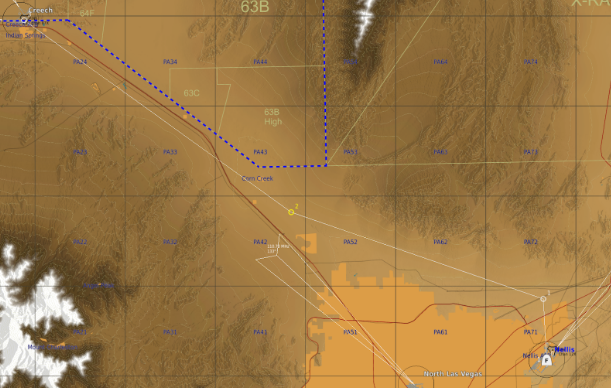

# Mission Editor Setup

## Radio Presets
All 80 radio presets (40 UHF and 40 VHF) are individually pre-programmable in the mission editor.

**Step 1:** Select the aircraft you wish to modify the presets for.  
**Step 2:** Navigate to the radio menu (circled below)

///caption
DCS Mission Editor Radio Preset editor
///
**Step 3:** Edit the UHF and VHF Radios as desired

!!! Note
    By default, the UHF Radios will be configured for KLSV (Nellis AFB) and the surrounding NTTR.

---

## Flight Plans

The T-38C will automatically convert the waypoints set in the mission editor into flight plan 0.  
You can preset a maximum of 69 waypoints, any more will be excluded from the jet. Additional flight plans can be configured externally in the DTC folder (TODO link this)

///caption
DCS Mission Editor Route Editor
///

---

## Training Zones

(TODO ADD INSTRUCTIONS FOR THIS)

Can be drawn from mission editor (expand on specifics)

!!! Warning
    Due to how DCS handles mfd drawings, our implementation of training zones supports a maximum of 20 zones, and 20 points per zone.  
    The real jet supports 50 zones, and 50 points per zone.  
    *This increases performance and decreases memory usage noticably, without impacting gameplay meaningfully*

---

## Low Level Routes

---

## No Fly Zones

---