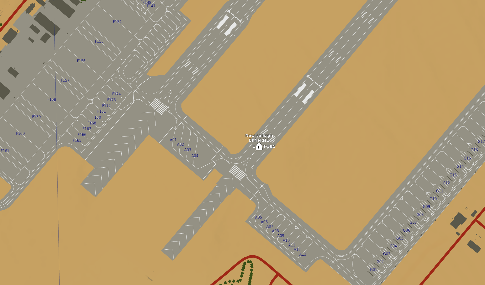
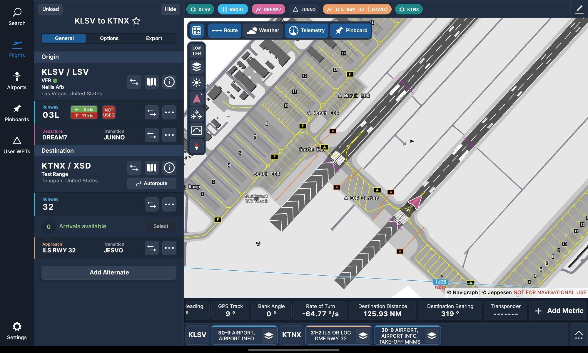

# Navigraph Integration
## Introduction
Caffeine Simulations have been very fortunate to partner with and contribute to the integration of Navigraph with DCS to bring features commonly associated with MSFS and XPlane into not just the T-38C but to all Aircraft, Modules and Mods.

T-38C Pilots fly with an Electronic Flight Bag (EFB) running apps like Foreflight to assist in navigation, flight planning, approach/departure charts, and much more. This can be replicated externally, even on a separate device like a tablet using the Navigraph Suite of applications

!!! Note
    Navigraph is a Paid service, more information can be found [here](https://navigraph.com/){target="_blank"}.

---

## Navigraph Charts
Navigraph Charts is an app that essentially replicates Foreflight, but in the Simulator environment. With a Navigraph Subscription, you can access charts, plan a flight, see your GPS position and various performance numbers (if using Simlink).

The Charts App can be run on either the same device as your DCS install, or on a tablet, externally (for example attached to your thigh like a kneeboard).

---

## Simlink
!!! Warning
    This Feature is not yet available to testers  
    TODO remove this message when the time is right

With a Navigraph subscription, you will be able to download the Simlink application, and install the DCS Simlink Plugin into your Saved Games/Scripts/Hooks Directory. Then restart DCS, and the Simlink app, and you will see your position replicated in real time in Navigraph Charts.
!!! Note
    This feature is not limited to the T-38C, and will work with all planes.

TODO add install guide

/// caption
DCS F10 Map
///

/// caption
Player position reflected in Navigraph Charts using the DCS SimLink plugin
///

---

## SimBrief
SimBrief Functionality TBD (but planned) (will be limited to T-38C only)

---

## Acknowledgements
Caffeine Simulations are extremely grateful to the Navigraph team for assisting in the creation of the DCS Simlink plugin.

!!! Note
    Caffeine Simulations are not paid to promote Navigraph, but we do use and endorse their products.
