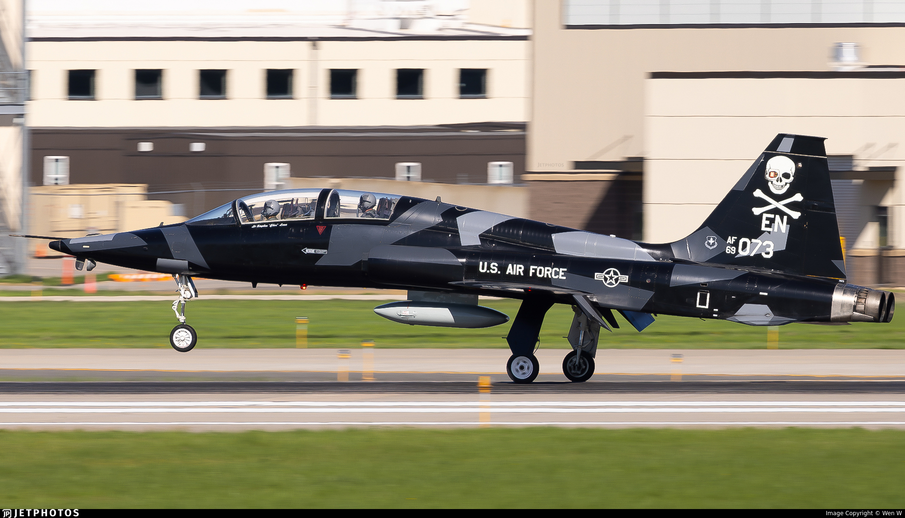

# DCS: T-38C Talon
## Introduction
The T-38C by Caffeine Simulations, is a free advanced jet trainer built for the combat flight simulator DCS World. Our Mission is to provide a platform to facilitate advanced training for 4th Gen DCS Fighters in Basic Fighter Maneuvers (BFM), Basic Surface Attack (BSA), along with multiship formation flying and tactics.

The T-38C has a highly complex navigation system, which we have Transposed into DCS World. 

!!! Note
    For the best experience we recommend using the NTTR (Nevada) map by Eagle Dynamics, although all other maps will work.

## Credits
A huge thank you to the following:  
**The Caffeine Simulations Team**

* Hayds: Lead Developer
* Space: Project Manager
* Shelter: Lead 3D artist
* Late: Lead Texture Artist
* Sina: Developer
* Coffee: Livery Artist
* Stingray: Livery Artist
* AFK: Sound Designer

**The DCS: OpenSource Team**

* BrianTheBrain: Multicrew, OFM, DCS SimLink Plugin
* Violent Nomad: OFM, Textures

**Additionally**

* JNelson: Several code snippets and algorithims
* Nibbylot: Code Snippets, knowledge
* Metal2Mesh: HGU-55 Helmet model
* Navigraph: m4rkus & Falcon, providing protocol for SimLink intergration with DCS

To our SME team, Pilots, Instructors, Maintainers, thank you for your hours spent in Voice Chats on discord, reference images, 3D scans, feedback and testing you provided to verify the accuracy of our simulations
